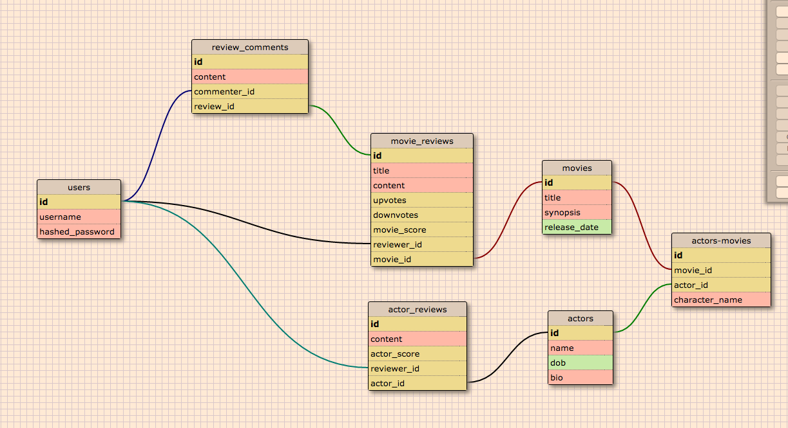
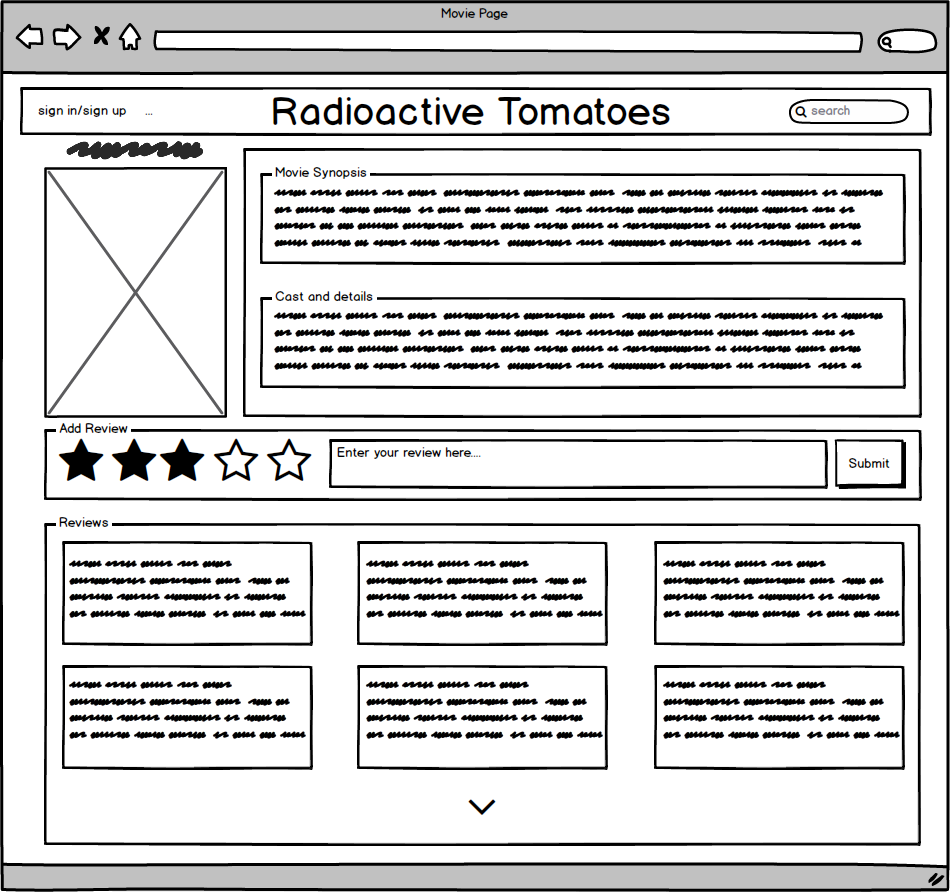
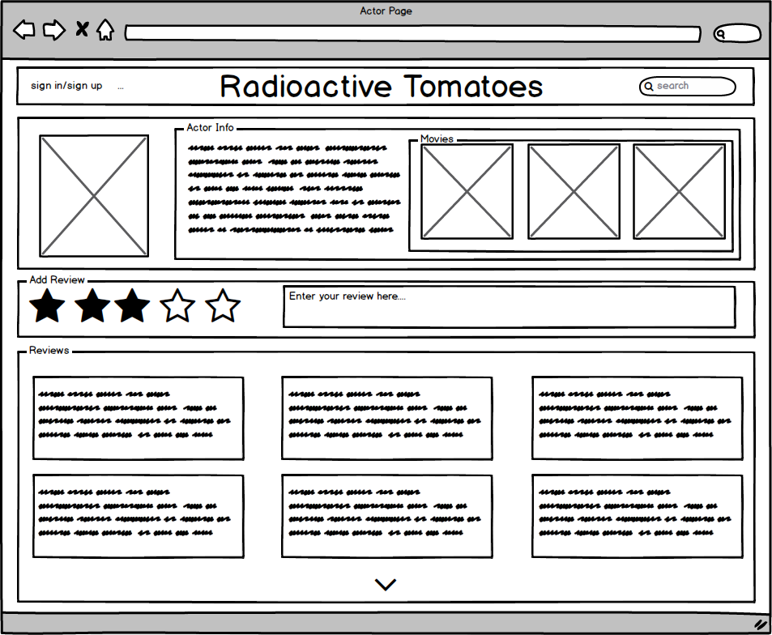
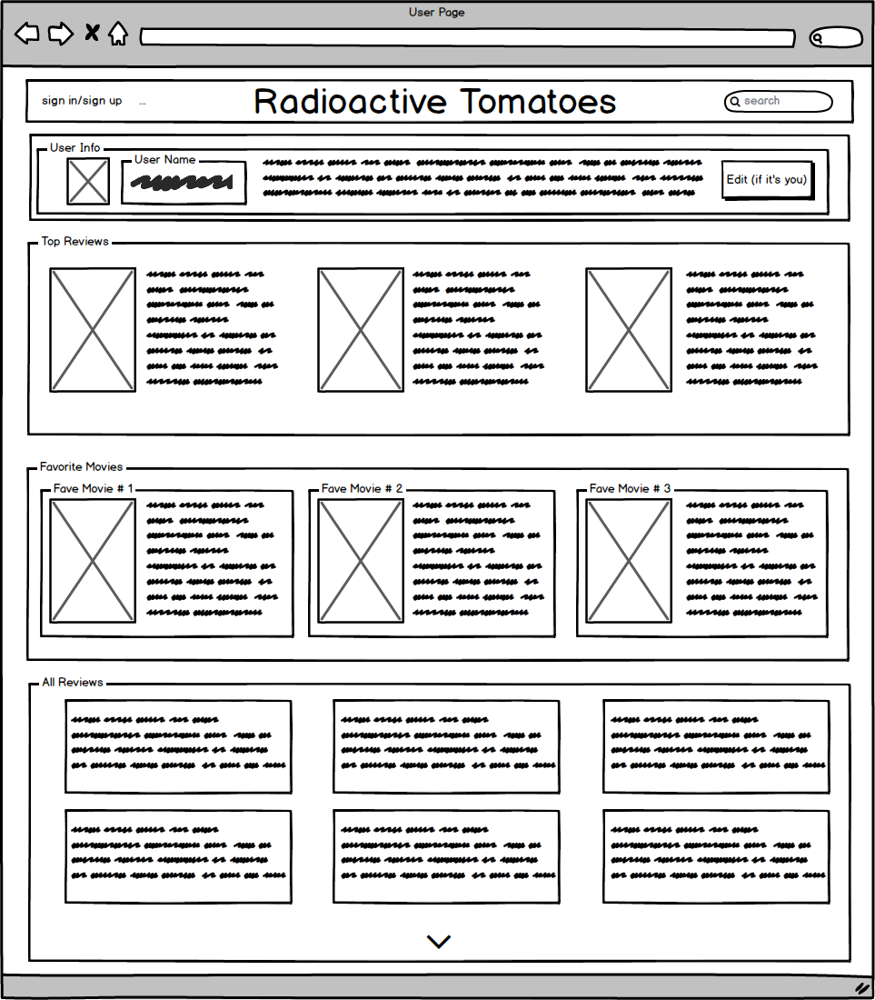
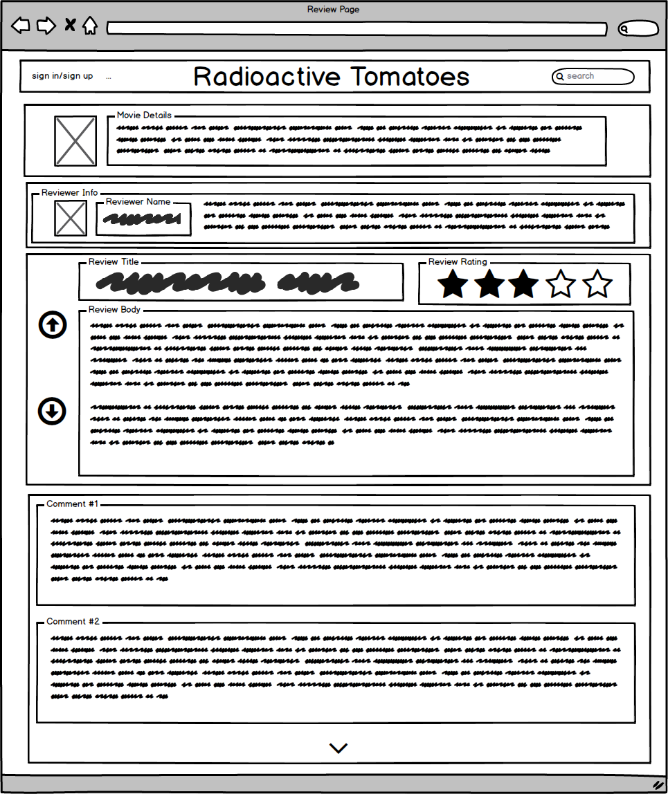

# Radioactive Tomatoes
Making movie reviews great again

## Database Schema

## User Workflow
We have omitted the user auth flow from the wireframes: when logged out, the login/register buttons will show up in the nav bar.  Register will take you to a simple form with username/email/password, and login will take you to a simple form with just username and password.

Both will show errors if necessary, and navigate back to the homepage on success.  When logged in, the login/register section will be replaced with a logout button.

### Key
On the following mocks, the arrow down symbol indicates that only as many as shown in the mock will be initially loaded, and hitting the down symbol will load in the rest of the list.

### Homepage wireframe:

Clicking on a genre's card will take you to that [genre's page](#genre-page)

Clicking on a movie's card will take you to that [movie's page](#movie-page)

### Movie Page

Clicking on the movie's genre link will take you to that [genre's page](#genre-page)

Clicking on an actor link will take you to that [actor's page](#actor-page)

Clicking on a review card will take you to that [review's page](#review-page)

Filling in and submitting the form will create a new review for that movie.

### Actor Page

Clicking on one of the actor's movie links will take you to that [movie's page](#movie-page)

Clicking on a review card will take you to that [review's page](#review-page)

### Genre Page

Clicking on a movie's card will take you to that [movie's page](#movie-page)

### User Page

Clicking on a movie's card will take you to that [movie's page](#movie-page)

Clicking on a review card will take you to that [review's page](#review-page)

### Review Page

Clicking on a movie/actor's card will take you to the page for that [movie](#movie-page) or [actor](#actor-page).

Clicking up/down will save an upvote/downvote for the review in the database.
